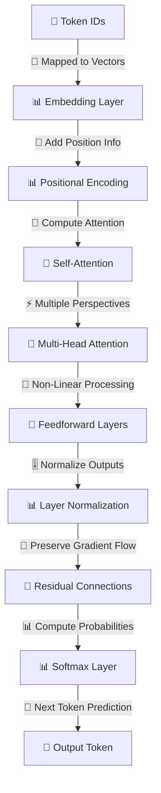

## **🚀 NEURAL NETWORK (CORE MODEL PROCESSING)**

> Transforms tokenized input into meaningful representations using deep learning techniques (Transformers).
> 

### **📌 1️⃣ Embedding Layer (Converting Token IDs into Dense Vectors)**

💡 **First transformation step** → Converts **discrete token IDs** into **continuous vector space**

🔹 **Each token ID is mapped to a high-dimensional dense vector**

🔹 **Captures meaning, relationships, and context**

📌 **Behind the Scenes (Technical Aspects)**

✅ Uses **pretrained word embeddings** (e.g., Word2Vec, FastText, GPT-style learned embeddings)

✅ Converts **token IDs** into **fixed-size vectors** (e.g., 768D, 1024D, 4096D for large models)

✅ Similar words have **closer vectors** in embedding space

📌 **Example: Token Embedding**

```
Token: "king" → [0.12, -0.55, 0.89, ..., 0.34]
Token: "queen" → [0.14, -0.50, 0.91, ..., 0.32]

```

📌 **Math Behind It**

```
Token ID → Embedding Matrix → Dense Vector

```

---

### **📌 2️⃣ Positional Encoding (Adding Word Order Information)**

💡 **Transformers have no inherent order** → Positional encoding **preserves sequence**

🔹 **Words in a sentence must be ordered meaningfully**

🔹 **Positional encodings are added to embeddings**

📌 **Behind the Scenes (Technical Aspects)**

✅ Uses **sinusoidal functions** or **learned embeddings** to represent positions

✅ Helps model **differentiate word positions** in sequences

✅ Important for long text understanding

📌 **Example: Positional Encoding**

```
Word Position: 1 → [sin(1), cos(1), sin(2), cos(2), ...]
Word Position: 2 → [sin(2), cos(2), sin(4), cos(4), ...]

```

📌 **Math Behind It**

```
PE(pos, 2i) = sin(pos / 10000^(2i/d))
PE(pos, 2i+1) = cos(pos / 10000^(2i/d))

```

---

### **📌 3️⃣ Self-Attention Mechanism (Understanding Context & Relationships)**

💡 **Determines how much attention each word should give to others**

🔹 **Key to LLMs** → Allows **context-dependent word understanding**

🔹 **Enables parallel processing of words** (unlike RNNs)

📌 **Behind the Scenes (Technical Aspects)**

✅ **Each word computes 3 vectors:** **Query (Q), Key (K), Value (V)**

✅ **Attention Score = (Q · K) / sqrt(d)** → How much **one token should focus on another**

✅ Output is a **weighted sum of Value (V) vectors**

📌 **Example: Attention Scores**

```
Sentence: "The cat sat on the mat."
"The" → [0.1, 0.4, 0.2, 0.3, 0.5] (Attention to all words)

```

📌 **Math Behind It**

```
Attention(Q, K, V) = softmax((Q * K.T) / sqrt(d)) * V

```

---

### **📌 4️⃣ Multi-Head Attention (Capturing Multiple Perspectives)**

💡 **Instead of a single attention mechanism, we use multiple heads**

🔹 **Each head captures different aspects of meaning**

🔹 **Combines multiple interpretations**

📌 **Behind the Scenes (Technical Aspects)**

✅ Splits embeddings into **multiple smaller vectors**

✅ **Each head runs independent self-attention**

✅ Outputs are **concatenated and projected back**

📌 **Example: Multi-Head Attention (Conceptual)**

```
Head 1 → Focuses on syntax
Head 2 → Focuses on semantics
Head 3 → Focuses on entity relationships

```

📌 **Math Behind It**

```
MultiHead(Q, K, V) = Concat(Head1, Head2, ..., HeadN) * W

```

---

### **📌 5️⃣ Feedforward Layers (Refining Word Representations)**

💡 **After attention, we refine word meaning using non-linear layers**

🔹 **Each token gets processed independently**

🔹 **Helps model learn hierarchical language features**

📌 **Behind the Scenes (Technical Aspects)**

✅ Uses **two fully connected layers** with **ReLU activation**

✅ Helps **capture abstract patterns** beyond attention

✅ Reduces **overfitting & improves generalization**

📌 **Math Behind It**

```
FFN(x) = max(0, xW1 + b1)W2 + b2

```

---

### **📌 6️⃣ Layer Normalization (Stabilizing Training)**

💡 **Ensures consistent scaling of activations**

🔹 **Normalizes outputs to prevent exploding gradients**

🔹 **Improves training efficiency & stability**

📌 **Behind the Scenes (Technical Aspects)**

✅ Uses **mean & variance normalization**

✅ Prevents **high-magnitude activations**

✅ Speeds up **convergence**

📌 **Math Behind It**

```
LayerNorm(x) = (x - mean) / sqrt(variance + epsilon)

```

---

### **📌 7️⃣ Residual Connections (Ensuring Gradient Flow)**

💡 **Solves vanishing gradient problem**

🔹 **Allows direct paths for gradient flow**

🔹 **Improves deep network stability**

📌 **Behind the Scenes (Technical Aspects)**

✅ Adds **previous layer's output to current output**

✅ Enables **deep networks without degradation**

📌 **Math Behind It**

```
Output = Input + Processed_Layer

```

---

### **📌 8️⃣ Final Softmax Layer (Generating Predictions)**

💡 **Converts logits into probabilities for word selection**

🔹 **Higher probability → More likely word**

🔹 **Top-k words selected via decoding**

📌 **Behind the Scenes (Technical Aspects)**

✅ Computes **exp(logit) / sum(exp(logits))**

✅ Normalizes outputs to **sum to 1**

📌 **Math Behind It**

```
P(word_i) = exp(logit_i) / sum(exp(logits))

```

---

## **🚀 VISUALIZING THE CORE NEURAL NETWORK**



---

## **✅ FINAL TAKEAWAYS**

🔥 **Each layer refines token representations before making predictions**

🔥 **Self-attention enables deep context understanding**

🔥 **Feedforward layers and normalization help stabilize learning**

🔥 **Softmax ensures probabilistic word selection for natural text generation**