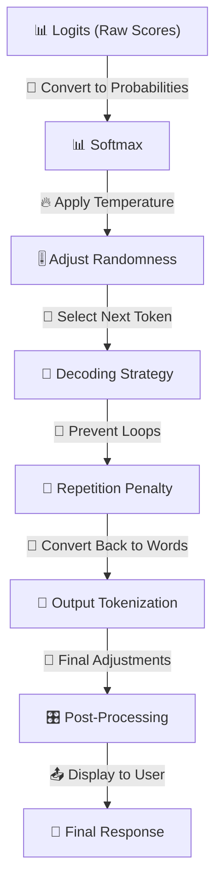

## **🚀 OUTPUT PROCESSING & DECODING (Generating the Final Response)**

> Converts processed token representations into meaningful words using probability-based selection techniques.
> 

🔹 **Takes the model’s internal representations → Converts them into probabilities → Generates readable text**

🔹 **Decoding strategies control creativity, coherence, and randomness**

🔹 **Final step before outputting the response**

---

## **📌 1️⃣ Logits & Probabilities (Scoring Next Word Choices)**

💡 **The model predicts a probability distribution over the vocabulary**

🔹 **Each token gets a logit score → Higher logit = More likely word**

🔹 **Softmax converts logits into probabilities**

📌 **Behind the Scenes (Technical Aspects)**

✅ **Logits = Raw scores before probability conversion**

✅ Softmax ensures all probabilities **sum to 1**

✅ Higher probability **= More likely word to be generated**

📌 **Example: Logits & Probabilities**

```
Logits: {"Paris": 6.3, "Berlin": 4.1, "London": 3.8}
Probabilities (Softmax): {"Paris": 82%, "Berlin": 12%, "London": 6%}

```

📌 **Math Behind It**

```
P(word_i) = exp(logit_i) / sum(exp(logits))

```

---

## **📌 2️⃣ Temperature (Controlling Randomness)**

💡 **Adjusts creativity & randomness in output selection**

🔹 **Lower temperature = More deterministic responses**

🔹 **Higher temperature = More diverse & creative outputs**

📌 **Behind the Scenes (Technical Aspects)**

✅ **Multiplies logits before softmax conversion**

✅ **Lower values (T < 1)** → Picks **more predictable** words

✅ **Higher values (T > 1)** → Introduces **more randomness**

📌 **Example: Different Temperature Settings**

```
T = 0.2 → Always picks "Paris"
T = 1.0 → Picks "Paris" 82% of the time, "Berlin" 12%
T = 1.8 → Picks any word randomly

```

📌 **Math Behind It**

```
P(word_i) = exp(logit_i / T) / sum(exp(logits / T))

```

---

## **📌 3️⃣ Decoding Strategies (Selecting the Next Token)**

💡 **Controls how words are chosen from probability distribution**

🔹 **Different methods affect coherence, randomness, and diversity**

📌 **Behind the Scenes (Technical Aspects)**

✅ **Greedy decoding** → Always picks **highest probability word**

✅ **Beam search** → Expands multiple choices & selects **most optimal sequence**

✅ **Top-k sampling** → Selects from **top k highest probability words**

✅ **Top-p (nucleus) sampling** → Selects from **cumulative probability threshold**

📌 **Example: Different Decoding Strategies**

```
"Today is a..."

Greedy: "sunny day."
Beam Search: "beautiful sunny day."
Top-k (k=5): "great day" / "cloudy day" / "hot afternoon"
Top-p (p=0.9): "rainy day" / "cold morning"

```

📌 **Comparison of Decoding Strategies**

| **Method** | **Description** | **Pros** | **Cons** |
| --- | --- | --- | --- |
| **Greedy** | Always picks highest probability word | Fast, deterministic | Can be repetitive, lacks creativity |
| **Beam Search** | Expands multiple paths, selects best sequence | More coherent | Computationally expensive |
| **Top-k Sampling** | Samples from top k choices | More diverse | Can lose meaning |
| **Top-p Sampling** | Samples from words within probability threshold p | More context-aware | Less predictable |

---

## **📌 4️⃣ Repetition Penalty (Avoiding Looping & Redundancy)**

💡 **Prevents model from repeating phrases excessively**

🔹 **Modifies probabilities of words already generated**

📌 **Behind the Scenes (Technical Aspects)**

✅ Applies **penalty factor** to words appearing earlier

✅ Reduces probability of repeating **exact words or phrases**

📌 **Example: Without vs. With Repetition Penalty**

```
Without: "The weather is nice today. The weather is nice today. The weather is..."
With: "The weather is nice today. It's a beautiful day."

```

📌 **Math Behind It**

```
P(word_i) = P(word_i) / penalty_factor^(count(word_i))

```

---

## **📌 5️⃣ Output Tokenization (Converting Tokens Back to Text)**

💡 **Transforms predicted token IDs into human-readable text**

🔹 **Reverses tokenization process**

🔹 **Ensures correct spacing, punctuation, and sentence structure**

📌 **Behind the Scenes (Technical Aspects)**

✅ **Merges subword tokens back into full words**

✅ **Handles special characters, punctuation, and spaces**

✅ **Removes any unnecessary markers (`<eos>`, `<pad>`)**

📌 **Example: Token IDs to Output Text**

```
Token IDs: [145, 56, 8903, 231, 29]
Decoded Text: "How do LLMs work?"

```

---

## **📌 6️⃣ Post-Processing (Final Adjustments Before Display)**

💡 **Final step before presenting output to the user**

🔹 **Handles formatting, special instructions, and chat history**

📌 **Behind the Scenes (Technical Aspects)**

✅ **Applies chat formatting (bold, lists, JSON outputs, etc.)**

✅ **Trims incomplete sentences**

✅ **Cleans up hallucinations or irrelevant outputs**

📌 **Example: Post-Processing Formatting**

```
Raw Output: "**Hello**! How are you?"
Final Output: "Hello! How are you?"

```

---

## **🚀 VISUALIZING THE OUTPUT PROCESSING PIPELINE**



---

## **✅ FINAL TAKEAWAYS**

🔥 **Output processing ensures token predictions result in meaningful text**

🔥 **Decoding strategies determine creativity, randomness, and coherence**

🔥 **Temperature, top-k, and top-p control diversity of outputs**

🔥 **Repetition penalty prevents loops & redundant phrases**

🔥 **Post-processing ensures clean, user-friendly responses**

This step **finalizes the response before outputting it to the user** 🚀