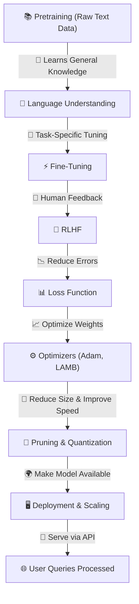

## **🚀 TRAINING & OPTIMIZATION (How LLMs Learn)**

> The process of teaching an LLM to understand, generate, and refine text using massive datasets.
> 

🔹 **LLMs start as "blank slates" and learn language by analyzing text patterns**

🔹 **Training involves massive compute power, high-quality datasets, and multiple optimization techniques**

🔹 **Three key phases** → **Pretraining → Fine-Tuning → Reinforcement Learning from Human Feedback (RLHF)**

---

## **📌 1️⃣ Pretraining (Learning the Basics of Language)**

💡 **First training stage** → Teaches **basic language structures & patterns**

🔹 **Uses large-scale datasets** → Wikipedia, books, news, code, etc.

🔹 **Goal: Predict missing or next words in text**

📌 **Behind the Scenes (Technical Aspects)**

✅ **Self-supervised learning** → No human labels, learns from text itself

✅ **Uses masked token prediction (MLM) or autoregressive learning**

✅ **Massive computational cost (weeks/months on TPUs/GPUs)**

📌 **Example: Masked Language Modeling (MLM - Used in BERT)**

```
Input: "The capital of [MASK] is Paris."
Model Predicts: "France"

```

📌 **Example: Autoregressive Training (Used in GPT Models)**

```
Input: "The sky is"
Model Predicts: "blue."

```

📌 **Math Behind It**

```
Loss = - Σ log(P(correct word | previous words))

```

---

## **📌 2️⃣ Fine-Tuning (Customizing the Model for Specific Tasks)**

💡 **Refines the model for domain-specific or specialized tasks**

🔹 **Uses smaller, high-quality labeled datasets**

🔹 **Fine-tunes weights without full retraining**

📌 **Behind the Scenes (Technical Aspects)**

✅ Uses **supervised learning (labeled examples)**

✅ Adjusts only **top layers or full model** (depending on dataset size)

✅ Often done using **Low-Rank Adaptation (LoRA) or Adapters**

📌 **Example: Fine-Tuning for Medical Applications**

```
Dataset: Clinical research papers
Before Fine-Tuning: "What is diabetes?" → General definition
After Fine-Tuning: "What is diabetes?" → Medical-grade answer with references

```

📌 **Math Behind It**

```
Fine-Tuned Loss = Pretrained Loss + Task-Specific Loss

```

---

## **📌 3️⃣ Reinforcement Learning from Human Feedback (RLHF)**

💡 **Aligns model responses with human values & preferences**

🔹 **Uses human feedback to improve response quality**

🔹 **Key to models like GPT-4, ChatGPT, Claude, etc.**

📌 **Behind the Scenes (Technical Aspects)**

✅ Humans **rank multiple responses** → Model learns preference order

✅ Uses **Reward Model (RM) to assign scores to responses**

✅ **Trained using Proximal Policy Optimization (PPO)**

📌 **Example: RLHF**

```
User: "Tell me a joke."
Option 1: Offensive joke (-10 reward)
Option 2: Family-friendly joke (+8 reward)

```

📌 **Math Behind It (Policy Optimization)**

```
θ* = argmax Σ R(y | x, θ)  (Maximizing Expected Reward)

```

---

## **📌 4️⃣ Loss Function (Measuring How Well the Model Learns)**

💡 **Computes how "wrong" the model's predictions are**

🔹 **The goal is to minimize loss** → Smaller loss = Better accuracy

🔹 **Different loss functions used for different tasks**

📌 **Behind the Scenes (Technical Aspects)**

✅ **Cross-entropy loss** → Common for text generation

✅ **Mean Squared Error (MSE)** → Regression tasks

✅ **Reward-Based Loss** → Used in RLHF

📌 **Example: Cross-Entropy Loss for Word Prediction**

```
True Word: "Paris"
Model Prediction Probabilities: {"Paris": 85%, "London": 10%, "Berlin": 5%}
Loss = -log(0.85) = 0.162

```

📌 **Math Behind It**

```
Loss = - Σ (True Label * log(Predicted Probability))

```

---

## **📌 5️⃣ Optimizers (Adjusting Model Weights to Reduce Loss)**

💡 **Updates model parameters to minimize the loss**

🔹 **Different optimization algorithms used based on efficiency & performance**

📌 **Behind the Scenes (Technical Aspects)**

✅ **SGD (Stochastic Gradient Descent)** → Basic optimizer

✅ **Adam (Adaptive Moment Estimation)** → Most common for LLMs

✅ **LAMB (Layer-wise Adaptive Moments)** → Used for very large-scale models

📌 **Example: Gradient Descent Updates**

```
Weight Update: W_new = W_old - learning_rate * gradient

```

📌 **Math Behind It**

```
θ = θ - α ∇ Loss(θ)

```

---

## **📌 6️⃣ Model Pruning & Quantization (Optimizing for Speed & Memory)**

💡 **Reduces model size without sacrificing too much accuracy**

🔹 **Pruning removes unimportant connections**

🔹 **Quantization reduces precision (e.g., FP32 → INT8)**

📌 **Behind the Scenes (Technical Aspects)**

✅ **Pruning** → Cuts weak neurons to shrink model

✅ **Quantization** → Uses lower-precision numbers for faster inference

✅ **Reduces cost & latency in deployment**

📌 **Example: Quantization Impact**

```
Before: Model uses 32-bit floating points (FP32)
After: Converts to 8-bit integers (INT8) → 4x smaller, 2x faster

```

---

## **📌 7️⃣ Deployment & Scaling (Bringing LLMs to Real Users)**

💡 **Final step where the model is deployed for real-world use**

🔹 **Optimized for cloud, edge devices, or on-premise usage**

📌 **Behind the Scenes (Technical Aspects)**

✅ **APIs** → Expose models via RESTful endpoints (e.g., OpenAI API, Hugging Face API)

✅ **Inference acceleration** → Uses TensorRT, ONNX Runtime, or DeepSpeed

✅ **Distributed inference** → Uses model parallelism to serve large-scale users

📌 **Example: API Deployment**

```
User sends: {"input": "What is AI?"}
API Response: {"output": "Artificial Intelligence is..."}

```

---

## **🚀 VISUALIZING THE TRAINING & OPTIMIZATION PIPELINE**



---

## **✅ FINAL TAKEAWAYS**

🔥 **Training is a multi-stage process: Pretraining → Fine-Tuning → RLHF**

🔥 **Loss functions & optimizers guide learning, reducing errors**

🔥 **Pruning & quantization optimize models for faster deployment**

🔥 **APIs allow real-world usage via cloud & edge devices**

This step **defines the intelligence & efficiency of an LLM** 🚀