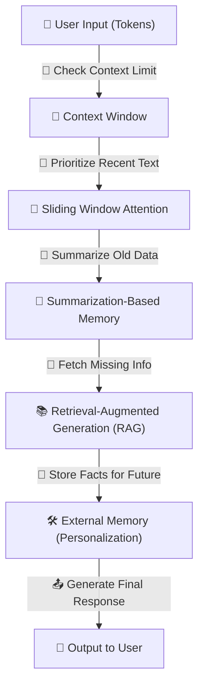

## **🚀 MEMORY & CONTEXT HANDLING (How LLMs Remember Information)**

> Ensures that an LLM maintains relevant information across multiple tokens or turns in a conversation.
> 

🔹 **LLMs don’t "remember" like humans** → They rely on **context windows, retrieval techniques, and attention mechanisms**

🔹 **Longer conversations require efficient memory strategies** → Prevents loss of earlier context

🔹 **Key strategies** → **Context Window, Attention Mechanisms, Sliding Window, RAG, and External Memory Systems**

---

## **📌 1️⃣ Context Window (How Much the Model Can "Remember")**

💡 **Defines how many past tokens the model can process at once**

🔹 **Measured in tokens** (GPT-4 = 32K, Claude = 100K)

🔹 **Exceeding this limit truncates older parts of conversation**

📌 **Behind the Scenes (Technical Aspects)**

✅ Model only **processes up to `N` tokens** at a time

✅ Older tokens are **discarded or summarized**

✅ Large context windows **require more memory and compute power**

📌 **Example: Context Window Effects**

```
Context Window: 4,096 tokens
Tokens Used: 3,500 (history) + 500 (new input)
Remaining Space: 96 tokens

```

📌 **Comparison of Context Windows Across Models**

| **Model** | **Context Window (Tokens)** |
| --- | --- |
| GPT-3.5 | 4K |
| GPT-4 | 32K |
| Claude-2 | 100K |

---

## **📌 2️⃣ Attention Mechanism (How the Model Chooses What to Focus On)**

💡 **Self-Attention decides which words in the sequence matter most**

🔹 **Each token looks at other tokens to find relationships**

🔹 **Prevents information loss across long text**

📌 **Behind the Scenes (Technical Aspects)**

✅ Computes **Query (Q), Key (K), Value (V) vectors**

✅ Higher **attention score** → More important words

✅ Prevents **word meaning loss** in long sequences

📌 **Example: Attention Scores**

```
Sentence: "Paris is the capital of France."
Attention to "Paris": [0.1, 0.2, 0.7, 0.0, 0.9]

```

📌 **Math Behind It**

```
Attention(Q, K, V) = softmax((Q * K.T) / sqrt(d)) * V

```

---

## **📌 3️⃣ Sliding Window Attention (Keeping Recent Context)**

💡 **For long conversations, models prioritize recent context**

🔹 **Prevents loss of important information in long texts**

🔹 **Oldest tokens get "forgotten" while maintaining recency**

📌 **Behind the Scenes (Technical Aspects)**

✅ Moves **window forward** as tokens exceed context limit

✅ Uses **chunking techniques** to retain key past information

✅ Improves performance for **chatbots and assistants**

📌 **Example: Sliding Window Effect**

```
Tokens: [A, B, C, D, E, F]
Window Size: 4
Processed: [B, C, D, E] (A removed)

```

---

## **📌 4️⃣ Summarization-Based Memory (Compressing Older Context)**

💡 **If older tokens exceed the window, the model summarizes past content**

🔹 **Creates a concise memory of past interactions**

🔹 **Used in chat applications for long conversations**

📌 **Behind the Scenes (Technical Aspects)**

✅ Past messages **compressed into a summary**

✅ Summary replaces older tokens **to retain key details**

✅ More effective in **open-ended, ongoing conversations**

📌 **Example: Conversation Summarization**

```
User: "What is AI?"
Model: "Artificial Intelligence is the simulation of human intelligence by machines."

[100 messages later]
Model Summary: "User asked about AI. Discussed its role in automation and neural networks."

```

---

## **📌 5️⃣ Retrieval-Augmented Generation (RAG) (Fetching External Knowledge)**

💡 **Retrieves documents, facts, or context to supplement responses**

🔹 **LLMs don’t store fixed knowledge → RAG fetches data dynamically**

🔹 **Improves factual accuracy & reduces hallucinations**

📌 **Behind the Scenes (Technical Aspects)**

✅ Uses **vector databases** (FAISS, Pinecone) for document retrieval

✅ Queries **external APIs or knowledge bases** (Wikipedia, scientific papers)

✅ Ensures responses stay **up-to-date & factually correct**

📌 **Example: RAG in Action**

```
User: "What are the latest iPhone specs?"
LLM: [Retrieves data from Apple website]
Response: "The iPhone 15 features an A17 Bionic chip, 48MP camera, and USB-C port."

```

📌 **Math Behind It (Vector Search)**

```
Similarity Score = cosine_similarity(Query_Vector, Document_Vector)

```

---

## **📌 6️⃣ External Memory Mechanisms (Long-Term Knowledge Retention)**

💡 **Stores structured memory for longer-term recall**

🔹 **Unlike context windows, memory persists across sessions**

🔹 **Used in AI chatbots for personalized conversations**

📌 **Behind the Scenes (Technical Aspects)**

✅ Saves user-specific facts into a **database**

✅ Uses embeddings to retrieve relevant details when needed

✅ Improves personalization in AI interactions

📌 **Example: AI Memory Storage**

```
User: "I have a dog named Max."
[Weeks Later]
User: "Remind me of my pet’s name."
Model: "Your dog’s name is Max!"

```

---

## **🚀 VISUALIZING MEMORY & CONTEXT HANDLING**



---

## **✅ FINAL TAKEAWAYS**

🔥 **Context Window sets the memory limit for conversations**

🔥 **Attention Mechanisms help retain and prioritize relevant words**

🔥 **Sliding Window Attention keeps recent messages in focus**

🔥 **Summarization compresses older history for efficiency**

🔥 **RAG enhances knowledge retrieval to improve factual accuracy**

🔥 **External Memory enables persistent AI recall for better personalization**

This step **ensures LLMs maintain relevant context across conversations** 🚀