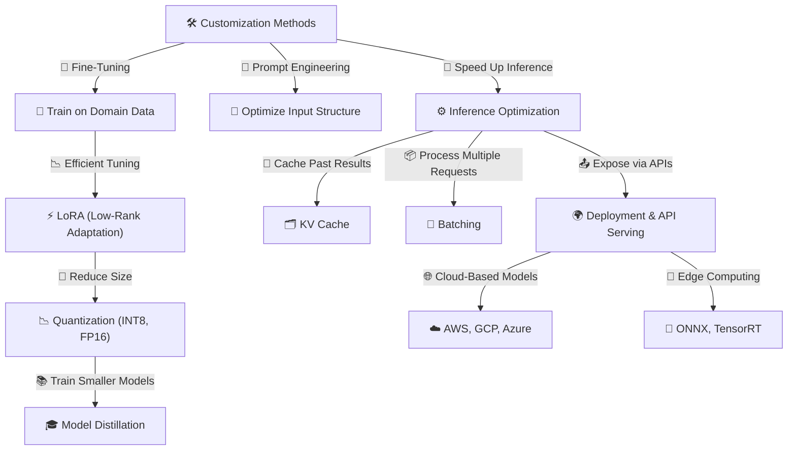

## **🚀 CUSTOMIZATION & INFERENCE (How LLMs Are Deployed & Used in Applications)**

> Ensures an LLM is fine-tuned, optimized, and efficiently served to users at scale.
> 

🔹 **LLMs must balance speed, accuracy, and cost for deployment**

🔹 **Customization adapts models to specific tasks (e.g., chatbots, code generation, customer support)**

🔹 **Inference optimizations ensure real-time performance with minimal latency**

---

## **📌 1️⃣ Fine-Tuning vs. Prompt Engineering (Ways to Customize an LLM)**

💡 **Two main ways to adapt an LLM for specific applications**

🔹 **Fine-Tuning** → Adjusts model weights for **domain-specific expertise**

🔹 **Prompt Engineering** → Optimizes input structure without changing model weights

📌 **Behind the Scenes (Technical Aspects)**

✅ **Fine-tuning** → Requires labeled datasets & retraining on task-specific data

✅ **Prompt Engineering** → Uses structured inputs to guide responses

✅ **Few-shot prompting** → Provides examples in the prompt to improve model accuracy

📌 **Example: Fine-Tuning vs. Prompt Engineering**

```
Fine-Tuning:
- Input: "Explain quantum physics."
- Output (Before): "Quantum physics studies subatomic particles."
- Output (After Medical Fine-Tuning): "Quantum physics explores quantum entanglement in biological systems."

Prompt Engineering:
- Input: "Explain quantum physics in 3 simple bullet points."
- Output:
  1. Matter behaves like waves & particles.
  2. Observing changes results.
  3. Everything is probabilistic.
```

📌 **Comparison**

| **Customization Method** | **Pros** | **Cons** |
| --- | --- | --- |
| **Fine-Tuning** | Customizable, domain expertise | Expensive, time-consuming |
| **Prompt Engineering** | Fast, no retraining needed | Less precise, can be inconsistent |

---

## **📌 2️⃣ LoRA (Low-Rank Adaptation) - Efficient Fine-Tuning**

💡 **Fine-tuning a model without changing the entire network**

🔹 **Only updates a small number of model parameters**

🔹 **Reduces compute cost while improving task-specific performance**

📌 **Behind the Scenes (Technical Aspects)**

✅ Instead of retraining all weights, **LoRA injects small adapter layers**

✅ Significantly reduces **GPU/TPU memory requirements**

✅ Helps **fine-tune models for niche applications**

📌 **Example: LoRA Efficiency**

```
Full Fine-Tuning → 175B parameters modified (expensive)
LoRA Fine-Tuning → Only 1M parameters modified (efficient)
```

📌 **Math Behind It**

```
ΔW = W + A * B  (LoRA updates small weight matrices A, B instead of full W)
```

---

## **📌 3️⃣ Quantization (Reducing Model Size for Faster Inference)**

💡 **Compresses model without losing much accuracy**

🔹 **Converts high-precision weights (FP32) into lower precision (INT8, FP16)**

🔹 **Speeds up inference and reduces hardware requirements**

📌 **Behind the Scenes (Technical Aspects)**

✅ Uses **bit-width reduction** → Lower bits = Faster computation

✅ **Trade-off** → Lower precision may reduce model accuracy slightly

✅ Popular tools → **GPTQ, AWQ, Hugging Face’s BitsAndBytes**

📌 **Example: Quantization Impact**

```
Before Quantization:
- Model: 175B parameters, FP32 precision
- RAM Needed: 700GB

After Quantization:
- Model: 175B parameters, INT8 precision
- RAM Needed: 175GB (4x smaller)
```

📌 **Comparison of Precision Levels**

| **Precision** | **Speed** | **Memory Usage** | **Accuracy** |
| --- | --- | --- | --- |
| FP32 (Full) | Slow | High | 100% |
| FP16 | Faster | Medium | ~99% |
| INT8 | Fastest | Low | ~98% |

---

## **📌 4️⃣ Model Distillation (Creating Smaller, Faster LLMs)**

💡 **Trains a smaller model to mimic a larger model’s behavior**

🔹 **"Student model" learns from a "teacher model"**

🔹 **Reduces model size while keeping strong performance**

📌 **Behind the Scenes (Technical Aspects)**

✅ **Teacher model (large LLM)** generates labeled examples

✅ **Student model (smaller LLM)** learns compressed knowledge

✅ **Result** → **Faster inference with lower memory cost**

📌 **Example: Model Distillation**

```
Teacher Model: GPT-4 (1 Trillion Parameters)
Student Model: GPT-4 Mini (7 Billion Parameters)

```

📌 **Math Behind It**

```
Loss = α * CrossEntropy(y_teacher, y_student) + β * Standard Loss

```

---

## **📌 5️⃣ Inference Optimization (Serving LLMs Efficiently)**

💡 **Making LLMs run efficiently in real-world applications**

🔹 **Uses caching, batching, and tensor parallelism**

🔹 **Reduces response time & increases scalability**

📌 **Behind the Scenes (Technical Aspects)**

✅ **KV Cache** → Saves computed attention values for faster response

✅ **Batching** → Groups multiple requests together for efficient processing

✅ **Tensor Parallelism** → Splits computations across multiple GPUs

📌 **Example: Inference Optimization**

```
Before KV Cache: 2-second response time
After KV Cache: 0.5-second response time

```

---

## **📌 6️⃣ Deployment & API Serving**

💡 **How LLMs are exposed to users via cloud, edge, or on-premise**

🔹 **Uses APIs, microservices, and serverless computing**

🔹 **Scalable architecture for real-world applications**

📌 **Behind the Scenes (Technical Aspects)**

✅ **REST APIs (e.g., OpenAI API, Hugging Face API)** → Expose LLMs for real-world apps

✅ **Edge Deployment (e.g., ONNX, TensorRT)** → Runs models on local devices

✅ **Cloud Scaling (AWS, GCP, Azure)** → Distributes inference load

📌 **Example: LLM API Request**

```json
{
  "input": "Explain quantum mechanics simply.",
  "temperature": 0.7,
  "max_tokens": 150
}

```

📌 **Example: API Response**

```json
{
  "output": "Quantum mechanics explains how particles behave at a microscopic level, often unpredictably."
}

```

---

## **🚀 VISUALIZING CUSTOMIZATION & INFERENCE**



---

## **✅ FINAL TAKEAWAYS**

🔥 **Fine-Tuning & Prompt Engineering adapt LLMs to different applications**

🔥 **LoRA enables efficient fine-tuning with fewer resources**

🔥 **Quantization & Distillation optimize model size & speed**

🔥 **Inference optimization techniques reduce latency & cost**

🔥 **APIs & Edge deployment make LLMs accessible in real-world applications**

This step **ensures LLMs are usable, scalable, and cost-effective for applications** 🚀