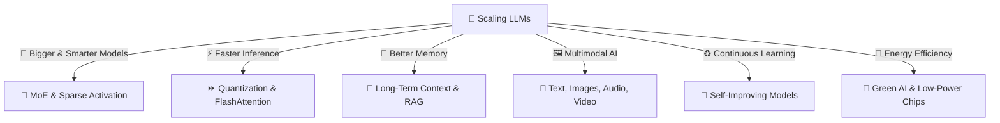

## **🚀 SCALING & FUTURE IMPROVEMENTS (How LLMs Continue to Evolve)**

> Focuses on making LLMs bigger, faster, cheaper, and more accessible while reducing their limitations.
> 

🔹 **LLMs are evolving towards higher efficiency, scalability, and real-time adaptability**

🔹 **Challenges like compute costs, inference speed, and memory limits are being actively solved**

🔹 **Future models are expected to be multimodal, more energy-efficient, and self-improving**

---

## **📌 1️⃣ Scaling Model Size vs. Efficiency Trade-offs**

💡 **Bigger models perform better but require massive computational resources**

🔹 **More parameters → More knowledge, but slower inference**

🔹 **Scaling must balance size, speed, cost, and energy consumption**

📌 **Behind the Scenes (Technical Aspects)**

✅ **Scaling Laws** → Larger models improve performance up to a limit

✅ **Parameter-efficient scaling** → Focus on smarter architectures instead of brute-force size increase

✅ **Mixture of Experts (MoE)** → Activates only relevant subnetworks for efficiency

📌 **Example: Scaling Comparison**

| **Model** | **Parameters** | **Performance** | **Energy Cost** |
| --- | --- | --- | --- |
| GPT-2 | 1.5B | Low | Low |
| GPT-3 | 175B | High | Very High |
| GPT-4 | >1 Trillion | Very High | Extremely High |
| MoE Model | 100B (active 10B per query) | High | Moderate |

📌 **Math Behind Scaling Laws**

```
Loss ∝ (Data Size)^-α + (Model Size)^-β + (Compute)^-γ

```

📌 **Future Scaling Direction**

| **Strategy** | **Improvement** |
| --- | --- |
| **Sparse Activation (MoE)** | Activates only part of the model per query |
| **Smaller but Smarter Models** | Focus on optimizing architecture rather than brute-force scaling |
| **Federated Training** | Distributed learning across devices |

---

## **📌 2️⃣ Faster Inference with Optimized Architectures**

💡 **Deploying LLMs at scale requires ultra-fast inference**

🔹 **Optimizations reduce latency and computational bottlenecks**

🔹 **Techniques like retrieval-augmented generation (RAG), quantization, and caching speed up responses**

📌 **Behind the Scenes (Technical Aspects)**

✅ **FlashAttention** → Optimizes memory access in Transformer models

✅ **KV Caching** → Reuses previous attention calculations for efficiency

✅ **Distillation & Pruning** → Reduces model size while preserving knowledge

📌 **Example: Inference Optimization Gains**

```
Before Optimization: Response Time = 1.5 sec
After Optimization: Response Time = 0.3 sec

```

📌 **Techniques to Improve Inference Speed**

| **Optimization** | **Effect** |
| --- | --- |
| **FlashAttention** | Reduces attention computation time |
| **KV Caching** | Avoids recomputation of attention for previous tokens |
| **Model Distillation** | Compresses models for faster responses |

---

## **📌 3️⃣ Memory-Efficient Models (Handling Longer Contexts)**

💡 **Memory bottlenecks limit how much context an LLM can retain**

🔹 **Current models have finite context windows (e.g., 32K tokens for GPT-4)**

🔹 **Future improvements aim for unlimited or extended memory capacity**

📌 **Behind the Scenes (Technical Aspects)**

✅ **Sliding Window Attention** → Prioritizes recent tokens dynamically

✅ **Memory-Augmented Models** → Stores long-term context in an external memory module

✅ **Hierarchical Retrieval** → Summarizes older conversations dynamically

📌 **Example: Increasing Context Window**

```
GPT-3: 4K tokens → GPT-4: 32K tokens → Claude-2: 100K tokens

```

📌 **Comparison of Context Retention Strategies**

| **Method** | **How It Works** |
| --- | --- |
| **Sliding Window Attention** | Retains recent text dynamically |
| **Memory-Augmented LLMs** | Uses external storage for long-term recall |
| **Hierarchical Summarization** | Generates high-level summaries for old text |

---

## **📌 4️⃣ Multimodal Capabilities (Beyond Text)**

💡 **Future LLMs will handle text, images, audio, and video**

🔹 **Multimodal learning allows AI to understand richer data formats**

🔹 **Applications include vision-language models (e.g., GPT-4V, CLIP)**

📌 **Behind the Scenes (Technical Aspects)**

✅ **Vision-LLMs** → Combine image and text understanding

✅ **Audio & Video Processing** → Enables real-time speech-to-text and video summarization

✅ **Neurosymbolic AI** → Merges symbolic reasoning with deep learning

📌 **Example: Multimodal Inputs**

```
Input: "Describe this image" (Uploads Image)
Model: "This is a cat sitting on a table."

```

📌 **Future Multimodal AI Applications**

| **Modality** | **Use Case** |
| --- | --- |
| **Vision + Text** | Describe images, understand memes |
| **Audio + Text** | Transcribe and generate podcasts |
| **Video + Text** | Summarize or search inside videos |

---

## **📌 5️⃣ Continual Learning & Auto-Improvement**

💡 **LLMs currently require full retraining for updates**

🔹 **Future models will learn continuously, adapting dynamically**

🔹 **Goal: Make AI capable of self-updating without massive retraining**

📌 **Behind the Scenes (Technical Aspects)**

✅ **Federated Learning** → Allows distributed model updates across devices

✅ **Meta-Learning** → Models that learn how to learn

✅ **Self-Supervised Refinement** → AI corrects its mistakes over time

📌 **Example: Continual Learning Vision**

```
Today: "LLMs cannot update knowledge dynamically."
Future: "AI learns from new articles daily without full retraining."

```

📌 **Techniques for Future Continuous Learning**

| **Method** | **Benefit** |
| --- | --- |
| **Federated Learning** | Updates models across decentralized systems |
| **Self-Supervised Learning** | Reduces reliance on human-labeled data |
| **Active Learning** | Model selects what data to learn from |

---

## **📌 6️⃣ Energy Efficiency & Sustainable AI**

💡 **Training large models consumes enormous electricity**

🔹 **Reducing AI’s carbon footprint is a key priority**

🔹 **Focus on hardware acceleration & more efficient architectures**

📌 **Behind the Scenes (Technical Aspects)**

✅ **Low-power AI chips (TPUs, neuromorphic processors)**

✅ **Sparse Activation (Mixture of Experts)**

✅ **Green AI training on renewable energy sources**

📌 **Example: AI Energy Consumption Comparison**

```
GPT-3 Training: 1,287 MWh (Equivalent to powering 120 homes for a year)
GPT-4 Efficiency: ~30% energy reduction using optimized TPUs

```

📌 **Future Trends in Green AI**

| **Technique** | **Energy Efficiency** |
| --- | --- |
| **Mixture of Experts (MoE)** | Reduces compute cost |
| **Efficient Transformer Models** | Cuts down GPU/TPU usage |
| **AI Hardware Optimization** | Uses specialized AI chips |

---

## **🚀 VISUALIZING FUTURE IMPROVEMENTS**



---

## **✅ FINAL TAKEAWAYS**

🔥 **Scaling must balance model size, efficiency, and cost**

🔥 **Inference optimizations enable real-time, low-latency responses**

🔥 **Multimodal AI expands LLM capabilities beyond text**

🔥 **Continual learning will enable dynamic knowledge updates**

🔥 **Green AI ensures sustainable model training & deployment**

This step **ensures that LLMs evolve towards being smarter, faster, and more sustainable** 🚀